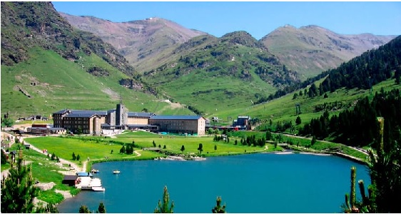

<!DOCTYPE html>
<html>

<head>
	<meta name="viewport" content="width=device-with,initial-scale=1.0"> 
	<title>		
		hikers
	</title>

</head>

<table border=3 cellspacing=10>	

				

				<h1> Caminants </h1>

<body background="fondo.jpg" width=300 height=200 style='color:blue' BGCOLOR='ALICEBLUE' TEXT='BLACK' LINK='BLUE'>

<tr>

<td>
								

  
  

</td>

		</table>

	_____________________________________________________________________________________________________________________________________________________________

	<marquee><b>
					dia 4 d`octubre 2019  (( Montserrat - Badalona ))
				</marquee>

<tr>
	<table border=3 cellspacing=10>	
			<td>

				 

		
			

				<b>dia 4 d`octubre 2019
(( Montserrat - Badalona ))
				
	
				Sordida en tren a les 14:30 desde Montgat

				arribada a monistrol a les 17.00

				sordida de monistrol a les 19
				arribem al sopar a les 21.30

				
					Joan
				

									<input type="button" onclick="location.href='Montser.html';" value="Inscripcio" />
		&nbsp;&nbsp;&nbsp;
									<input type="button" onclick="location.href='MontserTrack.html';" value="Recorregut" />
				</td>

				</table>
		
		</tr>

	____________________________________________________________________________________________________________________________________________________________

	<marquee><b>
					dia 9 de Novembre 2019  (( Queralbs , coma de Vaca - Nuria - Queralbs ))
				</marquee>
</table>

		<tr>
			<td></td>
			

			<td></td>
			<td></td>
			<td></td>
		</tr>

		<tr>
						<td></td>
			<td></td>
			<td></td>
<table border=3 cellspacing=10>		

<tr>
			<td>

				 

	
			
<b>

				dia 9 de Novembre 2019 - Queralbs - coma de Vaca - Nuria -> Queralbs ))

	
			
				Sordida circular
				amb cotxes desde el
				museu de Badalona

				

			Joan

									<input type="button" onclick="location.href='Nuria.html';" value="Inscripcio" />
																											&nbsp;&nbsp;&nbsp;
									<input type="button" onclick="location.href='NuriaTrack.html';" value="Recorregut" />

		</td>

		</tr>
	</table>
		<table>
		____________________________________________________________________________________________________________________________________________________________

	<marquee><b>
					dia 30 de Novembre 2019  ((El Carlit ))
				</marquee>
</table>

		<tr>
			<td></td>
			

			<td></td>
			<td></td>
			<td></td>
		</tr>

		<tr>
						<td></td>
			<td></td>
			<td></td>
<table border=3 cellspacing=10>		

<tr>
			<td>

				 

			
<b>

				dia 30 de Novembre 2019

				Pujada al Carlit

			
				Sortida amb cotxes desde Badalona
				fins a la Bollosa Puig Carlit
			    
Oscar Urenya

									<input type="button" onclick="location.href='Carlit.html';" value="Inscripcio" />
																		&nbsp;&nbsp;&nbsp;
									<input type="button" onclick="location.href='CarlitTrack.html';" value="Recorregut" />

			    </td>
	
		</tr>

	</table>

		&nbsp;&nbsp;&nbsp;
		

Consulta Participants

		<tr>

			<td></td>
			

			<td></td>
			<td></td>
		</tr>
		<tr>
						<td>
			

			</td>
			<td></td>
				<td></td>

		</tr>
		<tr>
				

			<td>

			</td>
				
					<td></td>
		</tr>

</body>
</html>
